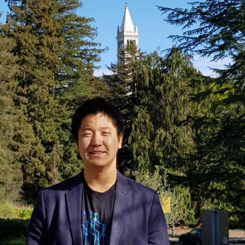
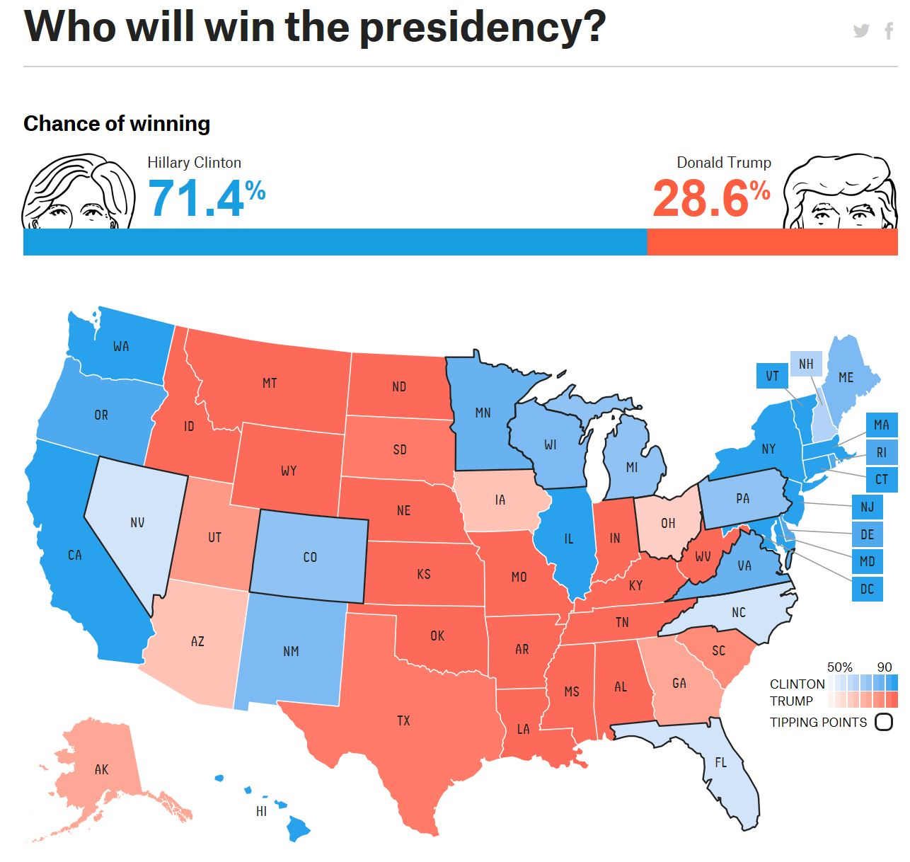
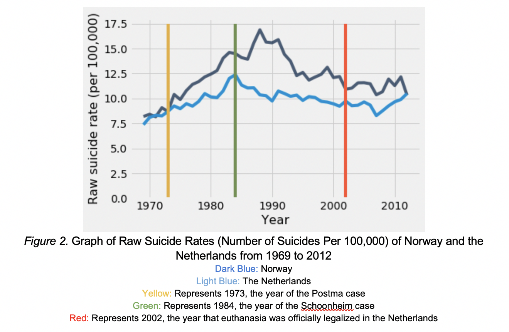

  

    Table of contents
  

  {: .text-delta }
1. TOC
{:toc}

# About Me

**Welcome to My Portfolio Website!**

My name is Yeh Chan (Yehchan) Yoo! I am currently a student in [the Master of Science program in Statistics - Advanced Methods and Data Analysis at the University of Washington](https://stat.uw.edu/academics/graduate/programs/fulltimemasters) -- expected to graduate in March 2026! I graduated from the University of California, Berkeley, in December 2023 -- having studied Statistics and Political Economy + minored in Data Science as an undergraduate. I also worked as the primary Data Scientist for [Mindful Conversion](https://mindfulconversion.com/) in 2024 before heading to the University of Washington for graduate school. 

This website was built to host some of the research work I did during the last few years; I sincerely hope you enjoy reading and interacting with my work!

(The work I have below is arranged by creation date from most recent to least recent.)

# 2023

## [CR4CR Autograder Model Presentation](https://docs.google.com/presentation/d/1loiDyL5mR43dCqcPDTUrSKDyb1Bcc8OAWEioZAG0kf4/edit?usp=sharing)

*Presented on October 9, 2023* ([Link](https://docs.google.com/presentation/d/1loiDyL5mR43dCqcPDTUrSKDyb1Bcc8OAWEioZAG0kf4/edit?usp=sharing), [PDF Link](<CR4CR Autograder Model Presentation (Yehchan Yoo, October 9, copy).pdf>))

<iframe src='https://docs.google.com/presentation/d/e/2PACX-1vQccxbmETAvqERuJJgqEJlBTFlKiXSQnPzanaNcz1AkRyLHu4FTeNIt947HWf9rlmBwlwuSIqHoS9iq/embed?start=false&loop=false&delayms=3000' frameborder='0' allowfullscreen='true' mozallowfullscreen='true' webkitallowfullscreen='true'></iframe>

In this presentation, I share the results of my research as a research assistant with UC Berkeley's [BEAR Center](https://bearcenter.berkeley.edu/) on the CR4CR project. The goal of the project was to explore how RoBERTa -- a state-of-the-art large language model -- could be applied to automatically grade short answers - a task with significant implications for scaling educational assessment. Through data collection, model training, and rigorous evaluation of a test set, I was able to develop a grading system that achieved a test accuracy of 75% when assessing short answers. In this presentation, I discuss the methodology, results, and limitations of the research, to further our understanding of both the potential and challenges of leveraging powerful deep learning models like RoBERTa for educational applications.

***

## [CR4CR GeoGebra Interactive Proof Presentation](https://docs.google.com/presentation/d/1PT9wc6rtE8hpJaVX5QkChUrdgqUd43HWN1Kl2LpgMFo/edit?usp=sharing)

*Presented on October 6, 2023* ([Link](https://docs.google.com/presentation/d/1PT9wc6rtE8hpJaVX5QkChUrdgqUd43HWN1Kl2LpgMFo/edit?usp=sharing), [PDF Link](<CR4CR GeoGebra Interactive Proof Presentation.pdf>))

<iframe src='https://docs.google.com/presentation/d/e/2PACX-1vSXiN1D7ALnrnZaZDLu2ZYIvD5owRJvK8bq5nMIbpnGbABDzwOn4L9npJVdnowtb-qhAQe7jJ0IP3iO/embed?start=false&loop=false&delayms=3000' frameborder='0'  allowfullscreen='true' mozallowfullscreen='true' webkitallowfullscreen='true'></iframe>

In this presentation for UC Berkeley's [BEAR Center](https://bearcenter.berkeley.edu/), I discuss my past work working with GeoGebra and the potential for the program to be used in developing interactive educational material. GeoGebra is a free educational software that allows for both the creation and sharing of dynamic visualization of geometry and algebra. I discuss what the development process is like for developing GeoGebra visualizations and share my tips for developing these visualizations effectively. I also share some of the applets I made on GeoGebra, which garnered over 15,000 views overall.

- Yehchan’s GeoGebra webpage: [https://www.geogebra.org/u/focicle2020](https://www.geogebra.org/u/focicle2020)
  - GeoGebra demos used in the presentation:
    - [Rearrangement Proof of the Pythagorean Theorem](https://www.geogebra.org/m/r2csGxMa)
      

    <iframe 
        scrolling="no" 
        title="Rearrangement Proof of the Pythagorean Theorem" 
        src="https://www.geogebra.org/material/iframe/id/r2csGxMa/width/918/height/682/border/888888/sfsb/true/smb/false/stb/false/stbh/false/ai/false/asb/false/sri/true/rc/false/ld/false/sdz/false/ctl/false" 
        frameborder="0" 
        allowfullscreen>
    </iframe>

    - [Power of a Point Proof Part 1: Between Two Chords](https://www.geogebra.org/m/PUbzFKSK)
      

    <iframe 
        scrolling="no" 
        title="Power of a Point Proof Part 1: Between Two Chords" 
        src="https://www.geogebra.org/material/iframe/id/y3BZVCwJ/width/1000/height/700/border/
    - [Bertrand's Paradox](https://www.geogebra.org/m/knm5erhz)
      

    <iframe 
        scrolling="no" 
        title="Bertrand's Paradox" 
        src="https://www.geogebra.org/material/iframe/id/qgqf8p2r/width/828/height/882/border/888888/sfsb/true/smb/false/stb/false/stbh/false/ai/false/asb/false/sri/true/rc/false/ld/false/sdz/false/ctl/false" 
        frameborder="0" 
        allowfullscreen>
    </iframe>

***

## [Inference and Prediction on Crude Diabetes Prevalence in U.S. States Based on Vegetable Consumption](DATA_C102_Project_Final_Project_Submission__CD_TE_CM_YY___230512_.pdf)

*Last updated on May 12, 2023* ([Link](DATA_C102_Project_Final_Project_Submission__CD_TE_CM_YY___230512_.pdf))

This paper was written in collaboration with my classmates [Christina Đặng](https://www.linkedin.com/in/christina-%C4%91%E1%BA%B7ng/), [Conan Minihan](https://www.linkedin.com/in/conanminihan/), and [Tetsuro Escudero](https://www.linkedin.com/in/tetsuro-escudero-542a93219/) as the final project report for DATA 102: Data, Inference, and Decisions, taught by [Mr. Ramesh Sridharan](https://www.rameshvs.com/) and [Professor Eaman Jahani](https://eamanjahani.com/) for the Spring 2023 semester.  This paper uses inferential and predictive techniques to examine the relationship between vegetable consumption and crude diabetes prevalence in American states and predict diabetes prevalence based on vegetable consumption.

# 2022

## [Replication and Improvement on "How do 401(k)s Affect Saving? Evidence from Change in 401(k) Eligibility"](group04_YY_XZ.pdf)

*Last updated on December 16, 2022* ([Link](group04_YY_XZ.pdf))

This paper was written in collaboration with my classmate [Xinyi Zi](https://www.linkedin.com/in/xinyi-zi/) as the final project paper for STAT 156: Causal Inference, taught by [Professor Peng Ding](https://statistics.berkeley.edu/people/peng-ding) for the Fall 2022 semester. This paper attempts to explore, replicate, critique, and re-do [Professor Alexander M. Gelber](https://gps.ucsd.edu/faculty-directory/alexander-gelber.html)'s 2011 causal inference paper ["How Do 401(k)s Affect Saving? Evidence from Changes in 401(k) Eligibility"](https://www.aeaweb.org/articles?id=10.1257/pol.3.4.103).

- Video presentation: [https://www.youtube.com/watch?v=Tpw7Ch7XJDg&feature=youtu.be&ab_channel=XinyiZi](https://www.youtube.com/watch?v=Tpw7Ch7XJDg&feature=youtu.be&ab_channel=XinyiZi)

<iframe src='https://www.youtube.com/embed/Tpw7Ch7XJDg' frameborder='0' allowfullscreen></iframe>

***

## [Effects of International Monetary Fund's Financial Crisis Policy Program in the Republic of Korea](pe101_term_paper.pdf)

*Last updated on December 9, 2022* ([Link](pe101_term_paper.pdf))

This paper was written as my term paper for POLECON 101: Contemporary Theories of Political Economy, taught by [Mr. Khalid Kadir](https://blumcenter.berkeley.edu/academics/gppminor/faculty/kadir/) for the Fall 2022 semester. Using some of the complex political economy theories taught in this course, this paper explores the political economy perspective of how the International Monetary Fund's program in response to South Korea's financial crisis in the late 1990s affected South Korean society in the short, medium, and long run.

***

## [Transit and Housing in California](https://deepnote.com/@berkeley-datathon-fall-2022-project/Presentation-3aa74663-1377-4af5-9f38-92009ab3c36b) 

*Last updated on November 13, 2022* ([Link](https://deepnote.com/@berkeley-datathon-fall-2022-project/Presentation-3aa74663-1377-4af5-9f38-92009ab3c36b))

This article was made within 3 days for the Fall 2022 UC Berkeley Datathon for Social Good and won second place in the Urban Studies track. For this article, my Datathon team (consisting of [Gain Boonavich](https://www.linkedin.com/in/gainsira/), [Anita Ding](https://www.linkedin.com/in/anita-ding-530238225/), [Yixin Huang](https://www.linkedin.com/in/yixin-huang-91b7781aa/), and myself) used Python to perform linear regression and create data visualizations to dive into the relationship between the amount of investment in transit and the number of housing units in Californian counties.

# Gap Years Due to Military Service (2020-2022)

*From May 4, 2020, to February 3, 2022*

I served in the Republic of Korea Air Force as a translator sergeant from 2020 to 2022 -- translating various government, legal, mechanical, and logistics documents (from Korean to English and from English to Korean) to facilitate smooth communication on logistical issues between the Republic of Korea Air Force and various foreign arms manufacturers.

# 2019

## [SAAS x Trace Data](https://docs.google.com/presentation/d/12Q5RciThBbhEOnpQ-6ASKT7Fe_ZnnH4NoDMHMqB73cE/edit?usp=sharing)

*Last updated on December 13, 2019* ([Link](https://docs.google.com/presentation/d/12Q5RciThBbhEOnpQ-6ASKT7Fe_ZnnH4NoDMHMqB73cE/edit?usp=sharing))

During the Fall 2019 semester, as a member of the Data Consulting committee in the Student Association for Applied Statistics (SAAS), I worked in a team to create our own JSON key-value pair classification systems using machine learning and natural language processing models with data provided by a startup named Trace Data (later acquired by [Netskope](https://www.netskope.com/)). More specifically, I worked with [Amal Bhatnagar](https://www.linkedin.com/in/amal-bhatnagar/) to create an unsupervised clustering algorithm using tf-idf as the main metric.

# 2018

## [Meaning of Probabilities in Social Sciences](/susa_research_yy_fall_2018.html)

*Last updated on December 20, 2023; originally written during the Fall 2018 semester* ([Link](/susa_research_yy_fall_2018.html))

As a declared Statistics major interested in social sciences, I often found that probability was used a lot in social science research. But I often wondered: *what do these probabilities fundamentally mean?* I wrote an article on the meaning of probabilities in social sciences to help answer this question during my time as a member of the Research and Publication Committee in Statistics Undergraduate Student Association (now called SAAS or Student Association for Applied Statistics).

- The title links to the raw HTML file of my article. The officially published version of my article is linked [here](https://saas.berkeley.edu/rp/meaning-of-probabilities-in-social-sciences).

***

## [Analyzing Undergraduate Statistics Majors’ Preparation in Communication with Non-Statisticians in the University of California, Berkeley](/statistics_communication_paper/Yoo_Yehchan_Spring2018_CompleteResearchPaper.pdf)

*Last updated on May 9, 2018* ([Link](/statistics_communication_paper/Yoo_Yehchan_Spring2018_CompleteResearchPaper.pdf))

Assessing the preparation of undergraduate statistics majors in statistical writing for non-statisticians at the University of California, Berkeley, revealed a significant gap. Despite substantial training in statistical writing within major classes, students lacked practical experience communicating with non-statisticians. Interviews with professors indicated a hesitancy to enforce stricter writing requirements, citing resource constraints and a desire for program growth. However, the findings underscored the pressing need for increased resources devoted to statistical writing education within the Department of Statistics. This project was written for my final project for the COLWRIT R4B class on discourse conventions in various academic fields.

***

## [Is there a statistical relationship between a region’s legalization of euthanasia and that region’s suicide rate?](https://saas.berkeley.edu/rp/suicide)

*Last updated on May 1, 2018* ([Link](https://saas.berkeley.edu/rp/suicide))

Statistical analysis of data from Mexico indicates that the legalization of passive euthanasia in certain Mexican regions likely is unrelated to the Mexican regions’ raw suicide rates in the short run. Difference-in-difference analysis on data from the Netherlands (and Norway) indicates that, while major events towards the legalization of active and passive euthanasia may have had a decreasing short-run impact on the raw suicide rate of the Netherlands, such effect -- if present -- likely became diluted over time. This research article was written during my time as a member of the Research and Publication Committee in Statistics Undergraduate Student Association (now called SAAS or Student Association for Applied Statistics).

***

## [Philosophy of Human Rights](/philosophy_of_human_rights/philosophy_of_human_rights.pptx)

*Last updated on April 11, 2018* ([Link](/philosophy_of_human_rights/philosophy_of_human_rights.pptx))

This presentation was created to teach members of Amnesty International at Berkeley about the philosophical meaning and questions behind the concept of human rights during my time in the organization.

- The title links to the PowerPoint version of my presentation. For the pdf version, go [here](/philosophy_of_human_rights/philosophy_of_human_rights.pdf).
