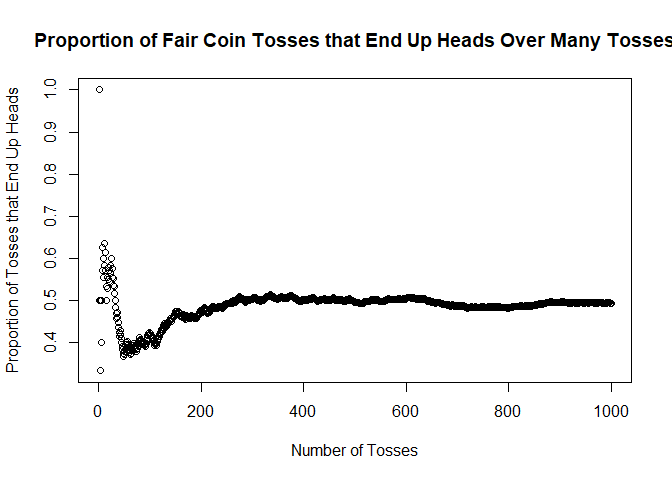

*This article was written for [the Statistics Undergraduate Student Association](https://susa.berkeley.edu/) in the University of California, Berkeley, during my time in the association as a Research and Publication member in Fall 2018 semester.*

## Table of Contents

1. [Introduction](#introduction)
2. [Defining Probability Mathematically](#defining_probability_mathematically)
3. [Starting with the Classical](#classical)
4. [Critical Objections to the Classical](#classical_objections)
5. [Making Probability Empirical: Frequentist Interpretation](#frequentist)
6. [Problems with Frequentist Interpretation](#frequentist_problems)
7. [Making Probability Personal: Bayesian Interpretation](#bayesian)
8. [Problems with Bayesian Interpretation](#bayesian_problems)
9. [Conclusion](#conclusion)
10. [Footnotes](#footnotes)

# Introduction {#introduction}

As a declared Statistics major interested in social sciences, I have been finding that probability is used a lot in social science research.

- To study a certain population, social scientists often use *probability sampling* - a technique in which they select members from a target population through an algorithm in which every member of the population has some calculable probability of being selected.[^1]

- Social scientists make statistical models to make probabilistic predictions for the future -- most notably, those working at [FiveThirtyEight](fivethirtyeight.com), a news website known for forecasting various political elections in the United States.[^2] The picture below shows [FiveThirtyEight's probabilistic prediction for the 2016 Presidential Election](https://projects.fivethirtyeight.com/2016-election-forecast/) on the day of the election.[^3] 


- Social scientists also make probabilistic predictions for the future without using statistical models. For instance, [in its 2018 report "Cause for concern? The top 10 risks to the global economy"](http://pages.eiu.com/rs/753-RIQ-438/images/Top_10_risks_to_the_global_economy.pdf?mkt_tok=eyJpIjoiTkdGa1lXVTROMlZsTW1FNCIsInQiOiI3XC9VSnkxdUFIYklHU0ZtWFJQK1JkSk03eXdBSWhLRVl3bGV0dk1IMEZzUHloSmJrakk0cnhISm5VZWYrNDYxYlp3ZW1tK3RFSTNWY1FQOVhJd1RHU3RFMVBzVE9ZeDdQXC81aHBQaE1sbE5iTWZsTGN3eW9yREZFS2VIcnNGNmkzIn0%3D), The Economist Intelligence Unit suggested that there is a very low probability - 0 to 10 percent - that multiple countries will withdraw from the Eurozone in the next two years.[^4]

But I often wonder: *what do these probabilities fundamentally mean?* When we say there is a 0 to 10 percent chance that multiple countries will withdraw from Eurozone in the next two years, how did that probability come to be? When FiveThirtyEight uses complex algorithms to compute the probability of a party winning the House or a court looks at the characteristics of a criminal to calculate the probability of that criminal committing a crime in the future, do these resulting probabilities have any mathematical or statistical significance?

I was inspired to ask this question after attending an event sponsored by the Statistics Undergraduate Student Association in my first semester at the University of California, Berkeley. In the event, statistics professor [Philip Stark](https://statistics.berkeley.edu/people/philip-stark) discussed the meanings behind the numbers we see in models like FiveThirtyEight's, questioning the utility of these numbers.

In my quest to explore the meaning behind probability values, and perhaps to also inform my social science-oriented and statistics-oriented friends about the meaning of probabilities they might use on a daily basis, I decided to conduct personal research on prominent probability interpretations and write this research article on these interpretations in relation to social science research.

With my ramblings out of the way, let us head straight into the world of probability interpretations!

Before starting, I want to note that:

- Codes in this article will be in R since I personally find R to be prevalent among those who do statistical calculations for social science research. That said, you do not have to be fluent in R to read this article.

# Defining Probability Mathematically {#defining_probability_mathematically}

Andrey Nikolayevich Kolmogorov (1903-1987) was a Soviet mathematician who conducted prominent research on various fields of mathematics, such as set theory, harmonic analysis, and number theory.[^5]

But his most famous achievements come from his research in probability theory, and one of his major achievements in probability theory involved **mathematically defining how probability values should be.**

Let $E$ represent the set of all possible outcomes that can occur from an event $X$, and let $X_i$ represent one of these possible outcomes. Let $P(X_i)$ represent the probability of outcome $X_i$ occurring for any $X_i \in E$.

*Kolmogorov's axioms* state that:

1. $0 < P(X_i) < 1, \forall X_i \in E$

2. $P(X_i) + P(\bar{X}_i) = 1, \forall X_i \in E$, where $\bar{X}_i$ is the complement of outcome $X_i$.

3. Let $S$ be a subset of $E$ consisting of some *mutually exclusive* outcomes of event $X$. Then
$$P(\bigcup_{X_m \in S}X_m) = \sum_{X_m \in S}P(X_m)$$

In everyday language, these axioms state that:

1. **All probability values are between 0 and 1.**
2. **The probability of an outcome happening for an event or of the outcome not happening for the event - that is, the probability of an event - is 1.**

For instance, the probability of rolling a 1 or a number other than 1 from tossing a six-sided die -- that is, the probability of getting any outcome from tossing the die -- is 1.

3. **The probability of occurrence of one of several mutually exclusive outcomes - outcomes of an event that cannot occur at the same time as another - is the sum of the probabilities of these outcomes occurring by themselves.**[^6][^7]

For instance, rolling a 1 and rolling a 2 are mutually exclusive outcomes since one cannot roll a 1 and a 2 at the same time from rolling a six-sided die. Hence, the probability of rolling a 1 or a 2 from rolling the die is the sum of the probability of rolling a 1 and the probability of rolling a 2.

These axioms are crucial when dealing with probability values mathematically.

**But these axioms do not explain what the fundamental nature of these probability values is.**

For instance, it can be seen from Kolmogorov's axioms that the probability of rolling a 1 or a 2 is between 0 and 1, is 1 minus the probability of not rolling a 1 or a 2, and is the sum of the probability of rolling a 1 and the probability of rolling a 2. But how would we obtain this probability value? What is the meaning behind this probability value?

One might be tempted to say (assuming the die is fair) the probability of rolling a 1 or a 2 is $\frac{1}{3}$. But how would we know that this probability is $\frac{1}{3}$? Can we be sure that this probability is $\frac{1}{3}$?

This is where probability interpretations come in to attempt to resolve this issue.

# Starting with the Classical {#classical}

When we initially learn about probability, we often see $P(X)$ defined as $\frac{m}{n}$, where:

- $m$ = the number of desired possible outcomes
- $n$ = the number of all possible outcomes with all possible outcomes being equally likely[^7]

This idea of probability comes from a probability interpretation named *the classical interpretation of probability*.

For instance, if you threw a fair six-sided die, you have a $\frac{1}{6}$ chance of rolling a 1, since

$$ P(\text{Rolling a 1}) = \frac{\text{Number of possible outcomes in which 1 is rolled}}{\text{Number of possible outcomes}} = \frac{1}{6} $$

This intuitive interpretation of probability is often associated with mathematicians Pascal, Bernoulli, and - most notably - Laplace[^8], who wrote in his *A Philosophical Essay on Probabilities*[^9],

<!-- The footnote for #9 is placed differently due to compatibility issues with Markdown footnote system  --->

> The theory of chance consists in **reducing all the events of the same kind to a certain number of cases equally possible**, that is to say, to such as we may be **equally undecided about in regard to their existence, and in determining the number of cases favorable to the event whose probability is sought.** The ratio of this number to that of all the cases possible is the measure of this probability, which is thus simply a fraction whose numerator is the number of favorable cases and whose denominator is the number of all the cases possible.

One of the principles bolded out in Laplace's quotes is called *the principle of insufficient reason* or *the principle of indifference* - the principle that an event will equally likely result in any outcome if there is no reason to believe that one outcome is more likely than the other due to a lack of knowledge on how the event can occur.[^10] The classical interpretation of probability is based on this principle.

The classical conception of probability works not only with variables with a finite number of possible values (like the number resulting from a die roll) but also works with variables with an infinite number of possible values (like the number resulting from randomly picking a real number between 0 and 1).

If a variable has an infinite number of possible values, each value has a zero probability of being picked. In calculating the probability of a large chunk of possible values being picked at random for such a variable, the infinite range of possible values can be split up into equally sized pieces from which certain pieces could represent the desired chunk of possible values.[^8]

For instance, if you are picking a real number between 0 and 1 (exclusive; that is, not including the end number 1) such that all real numbers in the range are equally likely to be selected, the probability of picking exactly 0.5 is 0, since

$$ P(\text{Picking 0.5}) = \frac{\text{Number of possible outcomes in which 0.5 is picked}}{\text{Number of possible outcomes}} = \frac{1}{\infty} = \boxed{0} $$

(Technically, $\frac{1}{\infty}$ does not equal 0, since $\infty$ is an idea, not a value. However, I used the equation $\frac{1}{\infty}=0$ anyway to indicate that there is an infinite number of possible outcomes here and hence each outcome has an infinitesimally small chance - that is, zero chance - of occurring.[^11])

However, the probability of picking a real number between 0.2 and 0.3 would be $\frac{1}{10}$, as

$$ \begin{equation}
\begin{split}
P(\text{Picking a number between 0.2 and 0.3}) & = \frac{\text{Number of chunks in which a desired number is picked}}{\text{Number of chunks of width 0.1 in [0,1): {[0,0.1),[0.1,0.2),...,[0.9,1)}}} \\
 & = \boxed{\frac{1}{10}}
\end{split}
\end{equation}
 $$

# Critical Objections to the Classical {#classical_objections}

A major problem with this interpretation of probability is that **there can be multiple ways of "reducing all the events of the same kind to a certain number of cases equally possible" for a given situation.** *Bertrand's paradox* helps demonstrate this problem:[^12]

(The applet was made by me; if the applet is not working properly, go to [this link](https://www.geogebra.org/m/knm5erhz).)

<iframe scrolling="no" title="Bertrand's Paradox" src="https://www.geogebra.org/material/iframe/id/qgqf8p2r/width/828/height/882/border/888888/sfsb/true/smb/false/stb/false/stbh/false/ai/false/asb/false/sri/true/rc/false/ld/false/sdz/true/ctl/false" width="828px" height="882px" style="border:0px;"> </iframe>

A simpler example would be a situation in which a factory is making cubes with random real side lengths between 0 and 1 foot (with all possible side length values being equally likely). What would be the probability that a randomly selected cube from the factory has a side length between 0 and $\frac{1}{2}$ feet? (Define $X$ to be the event in which the side length of a randomly selected cube from the factory is between 0 and $\frac{1}{2}$ feet.)

* Looking at *the side length*, $P(X) = \frac{\text{Length of range of desired side lengths}}{\text{Length of range of all possible side lengths}} = \frac{\frac{1}{2}\text{ feet } - \text{ 0 feet}}{\text{1 foot }-\text{ 0 feet}} = \boxed{\frac{1}{2}}$.
* Looking at *the surface area*, $P(X) = \frac{\text{Length of range of desired surface areas}}{\text{Length of range of all possible surface areas}} = \frac{(\frac{1}{2})^2\text{ square feet } - \text{ 0 square feet}}{\text{1 square foot }-\text{ 0 square feet}} = \boxed{\frac{1}{4}}$.
* Looking at *the volume*, $P(X) = \frac{\text{Length of range of desired volumes}}{\text{Length of range of all possible volumes}} = \frac{(\frac{1}{2})^3\text{ cubic feet } - \text{ 0 cubic feet}}{\text{1 cubic foot }-\text{ 0 cubic feet}} = \boxed{\frac{1}{8}}$.[^8]

These situations demonstrate that **one can end up with multiple different possible values for an unknown probability from using the principle of indifference under the classical interpretation of probability.**

**It is also controversial whether it is justified to derive probability values from ignorance using the principle of indifference.** It can be argued that the principle provides a reasonable path to dealing with the unknowns, but it can also be argued that it is also reasonable to assign ranges of possible values to probabilities of uncertain events (e.g. saying that the chance an event will happen in a certain way is between 0.4 and 0.6, not exactly 0.5) or to just not assign any values to such probabilities due to a lack of evidence on what the values of these probabilities can be.[^8]

# Making Probability Empirical: Frequentist Interpretation {#frequentist}

Such problems with the classical interpretation of probability led to the rise of two major interpretations of probability. One of these interpretations is *the frequentist interpretation*.

The frequentist interpretation of probability states that

$$ \text{Probability of desired outcome for an event} = \lim_{n\to\infty}{\frac{m}{n}} $$

where

- $n$ = the number of times the event occurs
- $m$ = the number of event occurrences that lead to the desired outcome.[^7]

For instance, assume if we flip a fair coin. By the frequentist interpretation of probability, the chance of ending up with a head is equal to the proportion of the coin flips that result in heads after flipping the coin an infinite number of times.

```r
# R simulation of flipping a coin 1000 times

# Produces 1000 numbers from unif(0,1) 
# -- i.e. randomly picks a real number from 0 to 1 with all numbers being equally likely to be picked
# A number less than 0.5 represents a coin toss that ends with tails
# A number equal to or greater than 0.5 represents a coin toss that ends with heads
runif1000 <- runif(n = 1000)

# n = number of tosses
# m = number of tosses that result in heads
coin_flip_data_frame = data.frame(n = 1:1000)
m = rep(-1, 1000)
prop_of_heads = rep(-1, 1000)
for (i in 1:1000){
  m[i] = sum(runif1000[1:i] >= 0.5)
  prop_of_heads[i] = m[i]/i
}
coin_flip_data_frame$m = m

# Showing only the results for the first 10 tosses
head(coin_flip_data_frame, 10)
```

```
##     n m
## 1   1 1
## 2   2 1
## 3   3 1
## 4   4 2
## 5   5 2
## 6   6 3
## 7   7 4
## 8   8 5
## 9   9 5
## 10 10 6
```

```r
# Showing graph of proportion of tosses that end with heads as more and more tosses are made
plot(data.frame(1:1000, prop_of_heads),
     main="Proportion of Fair Coin Tosses that End Up Heads Over Many Tosses",
     xlab="Number of Tosses", ylab="Proportion of Tosses that End Up Heads")
```



Notice how the proportion of tosses that end up heads converges to around 0.5 as the number of tosses increases.

As $\lim_{n\to\infty}{\frac{m}{n}} = 0.5$ (where $n$ = the number of tosses and $m$ = the number of tosses that result in heads), the probability of getting head from a fair coin toss is 0.5 under the frequentist interpretation of probability.

**The frequentist interpretation does not require the use of the principle of indifference** since the probability of the desired outcome for an event is only obtained through an empirical simulation of that event under this interpretation rather than by dividing the event into individual possible outcomes.

Since the frequentist interpretation adds a sense of empiricism to the idea of probability, many of the scientific methods used in social science research today are based on this interpretation of probability.[^7]

Most notably, using a large *simple random sample* to make statistical inferences about a population is based on the frequentist interpretation of probability. So is *any type of probability sampling*. Probability sampling works in estimating population variables without having to consult the entirety of the population itself since a repeated collection of large samples from a population through a proper random sampling technique shows that it is very likely to get a sample with a sample variable that is close to the corresponding population variable.[^13]

The frequentist interpretation of probability is what lends to statistical basis to *positivist methodologies of social sciences*, which involve the use of quantitative methods such as experiments and surveying to study human society.[^14] Positivist methodologies use random sampling - a methodology based on frequentist interpretation of probability - to make statistical inferences about a targeted population.[^15]

# Problems with Frequentist Interpretation {#frequentist_problems}

The frequentist interpretation is not perfect, though, both in a statistical and a social science context.

From a statistical context, while the frequentist interpretation resolves the issue of using ignorance to derive probability values by imposing an empirical definition on probability, **the frequentist interpretation does not provide a satisfactory resolution to Bertrand's Paradox or similar probabilistic paradoxes.**

If one is asked to find the probability of a randomly generated chord of a unit circle having a length greater than $\sqrt{3}$ as in [Bertrand's Paradox](https://www.geogebra.org/m/knm5erhz) under the frequentist interpretation, the probability value can vary depending on how a chord is generated in each iteration.

- Randomly generating a chord by randomly selecting the direction of the chord and the distance of the chord from the center would lead to the relative frequency of the desired outcome converging to $\frac{1}{2}$ as the number of iterations increases.

- Randomly generating a chord by randomly picking a point on the circle to be one point of the chord and then randomly picking a second point on the chord (by rotating the first point around the center by a random angle between 0 and 360 degrees) would lead to the relative frequency of the desired outcome converging to $\frac{1}{3}$ as the number of iterations increases.

- Randomly generating a chord by randomly picking a point inside the circle to be the midpoint of the chord would lead to the relative frequency of the desired outcome converging to $\frac{1}{4}$ as the number of iterations increases.[^12]

Also, **it is physically impossible to run an event an infinite number of times, and it is difficult to see how many times an event has to be run to get a decent approximation for the probability of a certain outcome for the event.** Especially since the proportion of iterations of an event that lead to the desired outcome may go up and down as the number of iterations increases, it is difficult to say when the probability value of the desired outcome is accurate enough or not.[^7]

Because of such limitations, **it is impossible to be absolutely sure if a probability is accurate or not under the frequentist interpretation.** If a coin is flipped 100 times and all flips lead to heads, it can be that the coin is so unfair as to always flip to heads. It can also be that the coin is fair and all the flips led to heads with a small but nonzero probability of $(\frac{1}{2})^{100}$. Assuming that the coin flips are all independent of one another (i.e. what happens in one coin flip does not affect the probability of flipping a head in another coin flip) and are all random, **the probability of flipping a head is constant regardless of what the result of coin flips will be.** But **it is the result of the coin flips from which we derive our probability values for possible outcomes from a coin flip.**

From the social science perspective, positivist methodologies based on the frequentist interpretation have been criticized for not focusing much on the motives and thoughts behind individual humans' social actions. Even some positivists like Paul Lazarsfeld - an American sociologist known for introducing survey-based research and statistical procedures for analyzing survey data - acknowledged the existence of limitations to positivist methodologies.

Criticisms towards such methodologies led to the rise of *antipositivist/interpretivist methodologies of social sciences*, which employ qualitative methods such as unplanned interviews and ethnography to study human society and often employ nonprobability sampling.

The criticisms also led to the rise of *post-positivism*, which tried to resolve the problems of positivist methodologies based on the frequentist interpretation of probability by accepting the use of positivist methodologies in social science research while suggesting that the knowledge obtained from these methodologies can be disproven but can never be seen as fully true due to the use of induction in the scientific method.[^14] Sir Karl Popper - a British philosopher credited for introducing post-positivism - wrote in his *The Logic of Scientific Discovery*:[^16]

> Now it is far from obvious, from a logical point of view, that we are justified in inferring universal statements from singular ones, no matter how numerous; for any conclusion drawn in this way may always turn out to be false.

As noted by Popper, in the same way a "universal statement" may not necessarily be correctly made from "singular ones", we could just accept that any probability estimate obtained from running an event many times may be inaccurate, but may still be accepted as having some truth to it.

Last but not least, **the frequentist interpretation struggles at finding probabilities for hard-to-replicate or irreplicable events.**[^7] A specific societal event set at a certain future date especially are not replicable and hence are impossible to predict under the frequentist interpretation of probability; it will be very difficult to imagine replicating the 2016 United States presidential election multiple times, for instance, and see how many of those times Hillary Clinton or Donald Trump wins!

# Making Probability Personal: Bayesian Interpretation {#bayesian}

In addressing this last problem comes another major interpretation of probability: *the subjective interpretation*.

*The subjective interpretation of probability* simply states that a probability is a degree of belief. That is, the probability of the desired outcome for an event is the degree of belief that the outcome will occur for that event.[^7]

As noted at the beginning, The Economic Intelligence Unit suggested that there is there is a very low probability - 0 to 10 percent - that multiple countries will withdraw from the Eurozone in the next two years.[^4] This chance given by the Economic Intelligence Unit is a *subjective probability* based on the subjective interpretation of probability. The probability reflects the organization’s belief in how likely this event is in the next two years based on what the organization sees.

This interpretation of probability is also known as *the Bayesian interpretation of probability*, as it is connected to a school of statistics called *Bayesian statistics*.[^7] Bayesian statistics revolves around *Bayes’ Theorem/Law*, which states

$$ P(H|E) = \frac{P(E|H)}{P(E)}P(H) $$

where $H$ = hypothesis and $E$ = evidence.[^17][^18]

$P(H|E)$ is the probability that the hypothesis is true in light of the evidence while $P(H)$ is the probability that the hypothesis is true before the appearance of the evidence. As a result, $P(H)$ is called *the prior probability* while $P(H|E)$ is called *the posterior probability*. $P(E|H)$ is the probability that the evidence appears if the hypothesis is true, while $P(E)$ is the probability that the evidence appears regardless of whether the hypothesis is true; $\frac{P(E|H)}{P(E)}$ is called *the likelihood ratio*.[^18]

**Bayesian statistics, along with the Bayesian/subjective interpretation of probability, is used in social sciences for statistical inference and statistical prediction.** Bayesian statistics can be used for calculating the chance of hard-to-replicate/irreplicable outcomes – like a candidate winning an election or the stock market going up after a certain period of time – based on past specific events and/or certain present conditions.

Law is a place where Bayesian statistics can be applied handily for decision analysis and statistical inference. Let’s say a person accused of committing a crime is on trial and the judge must decide whether the person is guilty and what the optimal sentencing for that person should be.

Looking at whether the person is guilty, let $G$ be the case that the person is guilty and $\sim{G}$ be the case that the person is not guilty. Let $P(G)$ be the probability that the person is guilty, $P(\sim{G})$ be the probability that the person is not guilty.

Most importantly, let $o(G) = \frac{P(G)}{P(\sim{G})}$ be the odd that the person is guilty (so that the person has an $o(G)$ to 1 odd of being guilty) and $o(G|E) = \frac{P(G|E)}{P(\sim{G}|E)}$ be the odd that the person is guilty in light of the evidence.

During the court trial, evidence $E$ is raised. The judge may, from his/her beliefs, try to derive her own probabilities that the evidence shows up if the person is guilty ($P(E|G)$) and that the evidence shows up if the person is not guilty ($P(E|\sim{G})$) throughout the trial.

Then, from here, we see

$$
P(G) = \frac{P(G|E)P(E)}{P(E|G)}, \text{ by Bayes' Theorem} \\
P(\sim{G}) = \frac{P(\sim{G}|E)P(E)}{P(E|\sim{G})}, \text{ by Bayes' Theorem} \\
\therefore o(G) = \frac{P(G)}{P(\sim{G})} = \frac{P(G|E)P(E)P(E|\sim{G})}{P(\sim{G}|E)P(E)P(E|G)} = \frac{P(G|E)P(E|\sim{G})}{P(\sim{G}|E)P(E|G)} \\
o(G|E) = \frac{P(G|E)}{P(\sim{G}|E)} \\
\therefore \boxed{o(G|E) = \frac{P(E|G)}{P(E|\sim{G})}o(G)}
$$

Lawyers in the trial will likely deal with both $P(E|G)$ and $P(E|\sim{G})$, as the lawyers will argue about how the evidence helps prove or disprove the person's guilt.

If additional pieces of evidence -- say, like $E_2$ -- shows up, then likelihood ratio $\frac{P(E_2|G)}{P(E_2|\sim{G})}$ can be multiplied to $o(G|E)$ to find the odds of the criminal being guilty in light of both $E$ and $E_2$. 

After all the possible evidence is collected, the odds of the criminal being guilty in light of all the evidence can be used to determine whether the criminal is guilty or not. The process above shows how Bayesian statistics and Bayesian interpretation of probability can be used for statistical inference.[^19]

# Problems with Bayesian Interpretation {#bayesian_problems}

The Bayesian interpretation is not philosophically perfect, however. For one, **it can be surprisingly easy for one to create probability values out of his/her beliefs that do not follow Kolmogorov’s axioms.** For instance, one could say that the probability of the event that Dow Jones rises tomorrow is 60% and the probability of the complement event that Dow Jones not rising tomorrow is 60%. As these two values add up to 120%, not 100%, Kolmogorov’s second axiom is violated.[^7] **However, one can account for this problem by making sure his/her probabilities do not violate Kolmogorov’s axioms.**

Another objection to Bayesian interpretation is that **the Bayesian interpretation can lead to multiple different possible conclusions for what the probability value of an outcome should be depending on what belief different people have for the occurrence of the outcome.**

**However, one can argue against this is neither a solid argument nor a huge problem.**

First of all, the objection implies that two people with the same knowledge of an event should come up with the same probability value for an outcome of that event. However, it both is hard to define and is impractical to see any two people having the exact same knowledge about an event. Also, if the implication is true, the probability should be able to be calculated without any reference to a person; unfortunately, there is no truly infallible way to calculate a probability without referring to a person.

Second, even if multiple different values are possible for a probability value, a widespread consensus on what that probability value is can help reduce the chaos that may come from varying levels of beliefs.

In fact, to an extent, this is how scientific method works; scientists may initially be split on the probability of an outcome occurring for an event but can gain consensus on what the value of that probability should be from gaining a variety of evidence from various methods of research.[^20]

Counterarguments against the objection can also offer a solution to Bertrand’s Paradox (and similar paradoxes) as well. Bertrand’s Paradox might have three different possible solutions, but – if the academic mathematics and statistics communities came to a consensus that the answer to the paradox is most believably $\frac{1}{2}$ – the answer to Bertrand’s Paradox can be perceived as $\frac{1}{2}$.

It must be noted, though, that scientists may not necessarily easily come to a consensus on what the value of a probability is in some circumstances. For instance, when FiveThirtyEight asked nuclear security experts (belonging to social sciences) about what the probability of deployment of a nuclear bomb on a civilian target will be in the ten years after 2017, the experts’ answers varied widely – ranging from “I’m uncomfortable trying to put a number on that” to less than 1% to 20-25%.[^21] In such cases, the subjective interpretation of probability may lead to confusion over how likely an outcome might be.

**There is also the question of whether humans are reliable in calculating probabilities for certain events based on their own beliefs.**

I once had a faculty coffee chat that I had with [Professor Lisa Goldberg](https://statistics.berkeley.edu/people/lisa-goldberg) from the University of California, Berkeley’s Statistics Department with other students from the university’s Statistics Undergraduate Student Association. Pondering over the philosophy of probability, I asked her if subjective probabilities are meaningful probabilities or not.

To this question, Professor Goldberg said yes and noted that **humans need and have evolved to use subjective probabilities in their everyday lives.** According to her, humans likely evolved to use the concept of subjective probabilities to help describe the uncertainty they faced in their lives and subjective probabilities still remain a crucial tool of measurement of uncertainty in human societies.

The professor does have a point, in my view. **Probabilities – including subjective probabilities – are a human invention, and subjective probabilities are such a prominent tool in describing the present and predicting the future among humans that it is hard to dismiss subjective probabilities as unreliable figures that humans are not meant to use.**

**However, it is also difficult to say that humans evolved to _reliably_ interpret probability values,** especially as recent studies revealed how humans can think irrationally in probabilistic situations.

Notably, psychologist Daniel Kahneman – who won Nobel Prize for Economics for merging psychology with economic research – worked with Amos Tversky to study how humans perceive probability.

During their research, they once asked their subjects to choose between the following two prospects:

**A.** 100% probability of losing \$3,000

**B.** 80% probability of losing \$4,000 with the remaining 20% probability being of losing nothing

Prospect A has an expected loss of $3000 \times 100% = 3000$ dollars, while Prospect B has an expected loss of $4000 \times 80% + 0 \times 20% = 3200$ dollars.

As Prospect B has a higher expected loss, one might think a rational person would choose Prospect A. However, 92% of the subjects chose Prospect B over Prospect A.

The result from this part of the research, along with results from other parts of the research, revealed that **people tend to be risk-happy when choosing between a greater loss that is very likely and a smaller loss that is certain,** even making decisions that are not necessarily rational by expected value.[^22]

In essence, **subjective probabilities are such a prominent human-made tool of measuring uncertainty that the use of these probabilities in human societies cannot be just dismissed.** But **humans are not necessarily rational in their use of probability** (as seen in Kahneman and Tversky’s study). So remains the question of how much we should put faith in using peoples’ degrees of belief to define probability values.

# Conclusion {#conclusion}

It must be noted that there are other interpretations of probability other than axiomatic, classical, frequentist, and Bayesian interpretations of probability. However, these are the most prominent interpretations in the statistics community in my observation, so I only felt the need to discuss these interpretations.

Summarizing the article:

- *Kolmogorov’s axioms* define probability mathematically.
- *Classical interpretation of probability* defines the probability of desired outcomes for an event as the number of desired outcomes over the number of all possible outcomes with all possible outcomes being equally likely, but faces the challenge that there may be more than one way of finding the probability of an outcome through this interpretation in certain situations – most notably, Bertrand’s paradox.
- *Frequentist interpretation of probability* defines the probability of desired outcomes for an event to be the number that the proportion of event occurrences that lead to the desired outcomes reaches as the number of event occurrences increases to infinity. This interpretation of probability sets the fundamentals for the positivist methodologies of social sciences but faces the challenge that it is impossible to run an event an infinite number of times and the methodologies based on this interpretation are limited in figuring out human understanding and intent behind individual human actions.
- *Bayesian/subjective interpretation of probability* defines probability as personal degree of belief and is part of a school of statistics called the Bayesian statistics. This interpretation of probability is useful in statistical inference and statistical predictions but faces the challenge that humans might be not unified and rational in their derivation of probability values based on their degrees of belief.
 
What I find fascinating here is that, **while probabilities are used to measure uncertainty in the real world, probabilities themselves often have meanings that are unclear or uncertain.** This does not mean probabilities should not be used in academic research, including social science research; rather, this means that everyone should think more deeply about what the probability values they encounter both in their everyday lives and in their research actually mean rather than taking these probability values for granted.

# Footnotes {#footnotes}

[^1]: *Social Science Research: Principles, Methods, and Practices* by Anol Bhattarcharjee, p. 67

[^2]: "Forecasting the race for the House" (https://projects.fivethirtyeight.com/2018-midterm-election-forecast/house/?ex_cid=midterms-header), "Forecasting the race for the Senate" (https://projects.fivethirtyeight.com/2018-midterm-election-forecast/senate/?ex_cid=midterms-header), "Forecasting the races for governor" (https://projects.fivethirtyeight.com/2018-midterm-election-forecast/governor/?ex_cid=midterms-header) from FiveThirtyEight

[^3]: "Who will win the presidency?" (https://projects.fivethirtyeight.com/2016-election-forecast/) from FiveThirtyEight

[^4]: "Cause for concern? The top 10 risks to the global economy" (http://pages.eiu.com/rs/753-RIQ-438/images/Top_10_risks_to_the_global_economy.pdf?mkt_tok=eyJpIjoiTkdGa1lXVTROMlZsTW1FNCIsInQiOiI3XC9VSnkxdUFIYklHU0ZtWFJQK1JkSk03eXdBSWhLRVl3bGV0dk1IMEZzUHloSmJrakk0cnhISm5VZWYrNDYxYlp3ZW1tK3RFSTNWY1FQOVhJd1RHU3RFMVBzVE9ZeDdQXC81aHBQaE1sbE5iTWZsTGN3eW9yREZFS2VIcnNGNmkzIn0%3D) from The Economist Intelligence Unit, p. 4

[^5]: "Andrey Nikolayevich Kolmogorov" (https://www.britannica.com/biography/Andrey-Nikolayevich-Kolmogorov) from Encyclopedia Britannica

[^6]: "Kolmogorov's Axioms" (http://mathworld.wolfram.com/KolmogorovsAxioms.html) from Wolfram MathWorld

[^7]: "What Is Probability?" (https://web.ma.utexas.edu/users/mks/statmistakes/probability.html) from the University of Texas at Austin's Department of Mathematics

[^8]: "Interpretations of Probability" (https://plato.stanford.edu/entries/probability-interpret/) from Stanford Encyclopedia of Philosophy

[^9]: *A Philosophical Essay on Probabilities* (https://books.google.com/books?id=WxoPAAAAIAAJ) by Pierre Simon marquis de Laplace, pages 6-7

[^10]: "Principle of Insufficient Reason" (http://mathworld.wolfram.com/PrincipleofInsufficientReason.html) from Wolfram MathWorld

[^11]: a webpage ( http://mathcentral.uregina.ca/QQ/database/QQ.02.06/evan1.html) from mathcentral.uregina.ca

[^12]: "Bertrand paradox" (https://www.encyclopediaofmath.org/index.php/Bertrand_paradox) from Encyclopedia of Mathematics, "Bertrand's paradox: Solving the 'hard problem'" (https://medium.com/quantum-physics/bertrands-paradox-9a6789dcf02e) from Medium, "Bertrand's Paradox" (http://web.mit.edu/tee/www/bertrand/problem.html) from MIT

[^13]: "Empirical Distribution of a Statistic" (https://www.inferentialthinking.com/chapters/10/3/Empirical_Distribution_of_a_Statistic) from *Computational and Inferential Thinking*

[^14]: *Social Science Research: Principles, Methods, and Practices* by Anol Bhattarcharjee, p. 7-8

[^15]: *Social Science Research: Principles, Methods, and Practices* by Anol Bhattarcharjee, p. 104

[^16]: *The Logic of Scientific Discovery* (https://books.google.com/books/about/The_Logic_of_Scientific_Discovery.html?id=Yq6xeupNStMC) by Karl Raimund Popper, p. 4

[^17]: “Bayesian statistics” (http://www.scholarpedia.org/article/Bayesian_statistics) from Scholarpedia

[^18]: “Bayes’ Theorem and Conditional Probability” (https://brilliant.org/wiki/bayes-theorem/) from Brilliant

[^19]: “The Philosophy of Statistics” (http://www.jstor.org/stable/2681060) by Dennis V. Lindley; published in *Journal of the Royal Statistical Society. Series D (The Statistician)*, Vol. 49, No. 3; p. 316-318

[^20]: “The Philosophy of Statistics” (http://www.jstor.org/stable/2681060) by Dennis V. Lindley; published in *Journal of the Royal Statistical Society. Series D (The Statistician)*, Vol. 49, No. 3; p. 302-303

[^21]: “We’re Edging Closer to Nuclear War” (https://fivethirtyeight.com/features/were-edging-closer-to-nuclear-war/) from FiveThirtyEight

[^22]: “Decision-Making Under Certainty - Advanced Topics” (http://www.econport.org/econport/request?page=man_ru_advanced_prospect) from EconPort